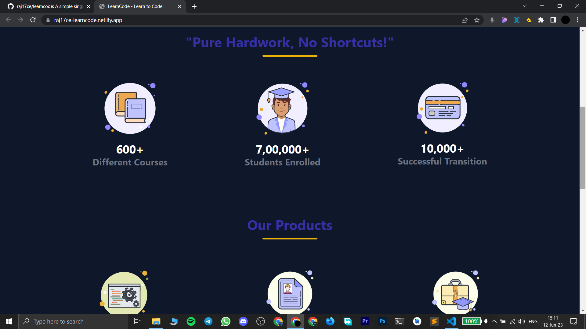

# LearnCode

### [Live Link](https://raj17ce-learncode.netlify.app/)

#### This is a simple webpage, that was built using HTML and Tailwind CSS. I made this project to test my learnings on Tailwind CSS.

## Functionalities

- A responsive webpage.

## Tech Stack

- HTML5 for creating the layout of the page.

- [Tailwind CSS](https://tailwindcss.com) for styling the webpage.

## ScreenShots

 

